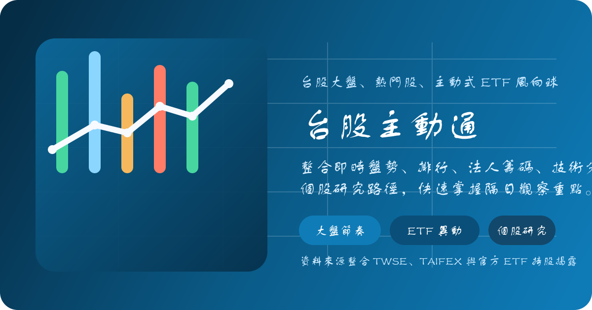
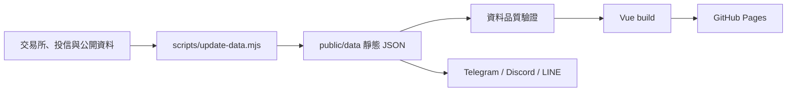

# 台股主動通 TW Active Tracker

> 把分散的台股盤勢、題材、ETF、個股、法人與事件資料，整理成一個可以循著線索往下研究的靜態網站。

[**線上體驗**](https://joe94113.github.io/TW_Active_Tracker/) · [個股研究範例](https://joe94113.github.io/TW_Active_Tracker/#/stocks/2330) · [ETF 中心](https://joe94113.github.io/TW_Active_Tracker/#/etfs)



**本專案僅供資訊整理、程式實作與研究參考，不構成投資建議、報明牌或收益保證。**

## 這是什麼？

台股主動通是一個以 `Vue 3 + Vite` 建構的台股研究儀表板。它將公開市場資料預先整理成靜態 JSON，再透過 GitHub Pages 提供瀏覽，不需要專屬後端或資料庫。

專案想解決的不是「再多一個股票排行榜」，而是資訊分散的問題：讓使用者可以從市場環境開始，逐步看到題材、ETF 資金、個股基本面與籌碼，最後再檢查事件與風險。

## 主要功能

| 研究主題 | 可以看到什麼 |
| --- | --- |
| 盤勢與全球環境 | 台股大盤、市場廣度、熱門股、國際股指、原物料、匯率與亞幣觀察 |
| 題材與選股 | 資金題材、產業熱度、新聞熱度、條件掃描、起漲候選與隔日觀察清單 |
| 個股研究 | 技術圖表、法人買賣、融資融券、持股分級、營收與財報、同產業比較、新聞與事件 |
| ETF 研究 | 主動式 ETF 持股、每日異動、淨值、重疊持股與高股息 ETF 換股方向 |
| 籌碼與風險 | 小型／微型臺指期貨、法人未平倉、勝率分點、注意股、處置股與變更交易 |
| 個人化與學習 | 自選股看板、健檢中心、公開觀點雷達與新手友善的股票小教室 |

## 建議的使用路徑

1. 先從首頁與國際盤確認當天市場環境。
2. 透過題材、產業與 ETF 異動尋找值得進一步研究的方向。
3. 在條件掃描或起漲雷達中縮小個股範圍。
4. 回到個股頁交叉檢查價格、量能、法人、基本面與事件。
5. 最後查看官方風險名單、過熱警示與資料新鮮度。

所有排行、訊號與統計都是研究起點，不是自動交易決策。

## 資料來源與更新

專案整合官方與第三方公開資料，主要包含：

- TWSE、TPEx、TAIFEX 與 TDCC 公開資料
- 各投信官方 ETF 持股與淨值揭露
- Yahoo Finance 市場走勢資料
- Google News 新聞聚合
- HiStock、富邦 eBroker、CMoney 等公開分點資訊

GitHub Actions 會在平日盤中約每 15 分鐘更新，並在收盤後多次執行更新，以補抓較晚公布的法人、期貨、財務與 ETF 資料。GitHub 排程與上游公告時間都是 best-effort；遇到休市日或上游尚未公布時，網站可能沿用最近交易日，不同欄位也可能屬於不同資料日。

網站內的新鮮度標記與來源健康狀態可用來辨識當前資料是否已沿用快取。當上游出現限流、拒絕存取或格式變動時，更新器會嘗試重試、降級或沿用前一次可用快照；部署前的資料品質門檻會阻止數量大幅縮水或日期倒退的資料被發佈。

## 資料流程



Web 前端不會直接對所有上游網站發出大量請求；大部分資料已由排程腳本整理為可快取的靜態檔案。

## 技術組成

- Vue 3、Vue Router
- Vite、Tailwind CSS
- ECharts、Lightweight Charts
- SheetJS (`xlsx`)
- Node.js 資料整理腳本
- GitHub Actions、GitHub Pages
- 可選的 Cloudflare Workers LINE webhook

## 快速開始

### 環境需求

- Node.js 22 以上
- npm

### 啟動開發環境

```bash
git clone https://github.com/joe94113/TW_Active_Tracker.git
cd TW_Active_Tracker
npm ci
npm run dev
```

倉庫內已附靜態資料快照，因此啟動前端不強制要求先連線抓取全部資料。排程產生的線上版資料可能比 Git 倉庫內的快照更新。

### 更新與驗證資料

```bash
npm run data:update
node scripts/validate-data-quality.mjs
```

`data:update` 會存取多個外部來源，完成時間與結果會受網路、限流與上游服務狀態影響。

### 執行測試與建置

```bash
node --test scripts/lib/resilient-request.test.mjs scripts/lib/broker-branch-radar.test.mjs
npm run build
npm run preview
```

## 專案結構

```text
src/                  Vue 頁面、元件、composables 與前端邏輯
public/data/          網站使用的靜態資料包
scripts/              資料更新、驗證、通知與管理腳本
scripts/lib/          可重用的資料整理與分析模組
line-bot/             LINE webhook 與 Flex Message 實作
config/               LINE rich menu 等設定
.github/workflows/    排程更新、品質檢查、部署與通知
```

## 可選的通知整合

倉庫內包含 Telegram、Discord 與 LINE 的盤後摘要／事件通知腳本，也提供可部署到 Cloudflare Workers 的 LINE 關鍵字回覆 webhook。這些整合都不是啟動網站的必要條件。

如果要在自己的 fork 啟用通知，請透過 GitHub Actions Secrets 或 Cloudflare Secrets 提供應用程式需要的憑證，**不要將 token、webhook URL 或 channel secret 提交到倉庫**。

## 如何貢獻

Issue 與 Pull Request 都歡迎用來回報錯誤、補充資料來源、改善可讀性或提出新的研究視角。

建議在送出 PR 前：

1. 說明修改要解決的使用情境與資料影響。
2. 確認沒有將憑證、個人資料或大量無關的產生檔一併提交。
3. 執行相關測試與 `npm run build`。
4. 如果變更上游資料解析，請提供可重現的範例與 fallback 說明。

## 授權

目前此倉庫尚未提供 `LICENSE` 檔案。可公開瀏覽原始碼不等於自動獲得重製、散佈或商業使用授權；如果希望在其他專案重用程式碼，請先與維護者確認。

## 使用限制與免責聲明

- 本專案不是券商交易系統，不提供下單或自動交易。
- 資料可能延遲、缺漏、沿用快取，或因上游格式變動而解析錯誤。
- 歷史統計、技術訊號、新聞摘要與雷達排名不代表未來表現。
- 實際投資決策前，請回到交易所、投信與發行公司等原始來源再次核對。
